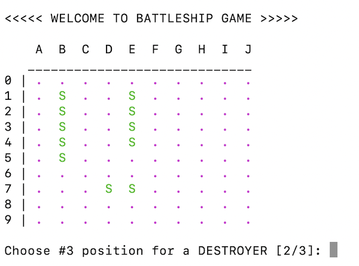
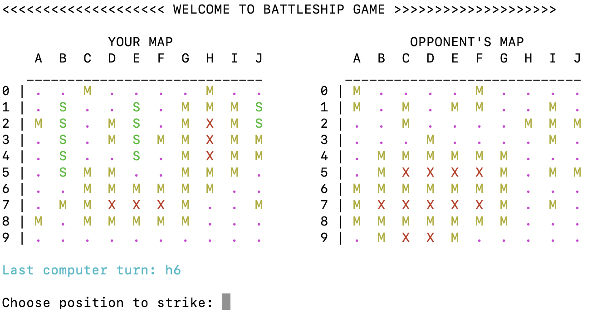

# Battleship on C

Battleship is a strategy type guessing game for two players. It is played on ruled grids (paper or board) on which each player's fleet of ships (including battleships) are marked. The locations of the fleets are concealed from the other player. Players alternate turns calling "shots" at the other player's ships, and the objective of the game is to destroy the opposing player's fleet. [[_Source - (Wiki)_](https://en.wikipedia.org/wiki/Battleship_(game))]

## How it works

1. 2002 variation of the game. Fleet consists of one ship of each type:

   - Carrier - size 5
   - Battleship - size 4
   - Destroyer - size 3
   - Submarine - size 3
   - Destroyer - size 2 <br />
     <br />

2. User plays against computer. To start the game open `Terminal`, checkout to the source folder and type:

   ```sh
   $ ./battleship
   ```

3. Use `MakeFile` to make changes to the sources files and compile a new program. To compile a new program checkout the to source folder and type:

   ```sh
   $ make
   ```

   or

   ```sh
   $ make re
   ```

## Screenshots

- Ship placement:
  <br>
  <br>
  

- Game simulation:
  <br>
  <br>
  

- End of the game:
  <br>
  <br>
  
